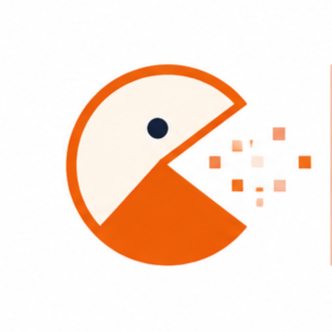
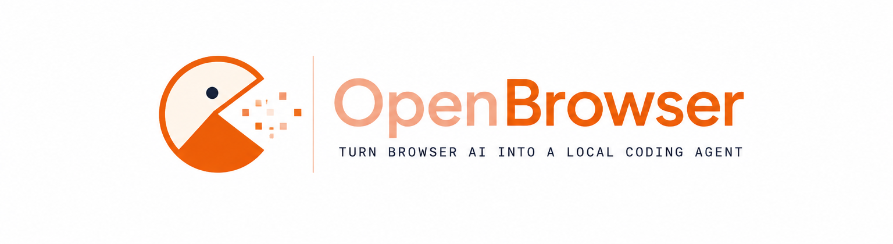

<h1 style="display: flex; align-items: bottom;">
  
  <span>
    <span style="color: #FFDAB9;">Open</span><span style="color: #FF8C00;">Browser</span>
  </span>
</h1>

<p align="center">
  
</p>

<p align="center">
  <a href="https://github.com/1129Aliasgar/OpenBrowser/blob/main/LICENSE"></a>
  <a href="https://github.com/1129Aliasgar/OpenBrowser"></a>
  
  
</p>

**Turn free browser AI chat into a local coding agent — no API key, no extra AI subscription.**

OpenBrowser is a **free AI tool** and **local AI agent harness** that connects ChatGPT, Gemini, DeepSeek, Claude, Perplexity, GLM, Grok, and other browser-based AI assistants to your project workspace. Run commands in the terminal — prompts are **auto-sent to your AI tab** via the browser extension, responses flow back to the terminal automatically. No manual copy-paste. **No API keys required** — use your existing **browser AI subscription** (including free plans).

> **Star the repo** on [GitHub](https://github.com/1129Aliasgar/OpenBrowser) to support the project and help others discover it.

---

## What is OpenBrowser?

OpenBrowser is an open-source **AI agent** for developers who want **ChatGPT for free coding**, **Claude for free coding**, or any browser AI plan — without paying for a separate API key or AI subscription. It acts as a **CLI harness** between your terminal and the AI chat tab you already use in Chrome.

- **Free AI tool** — works with free browser tiers (ChatGPT, Claude, Gemini, and more)
- **No API key** — your browser session is the connection; no OpenAI or Anthropic API billing
- **AI coding agent** — ask questions, edit files with diff preview, attach `@file` / `@folder` context
- **Local-first** — bridge runs on `127.0.0.1`; you approve every file change

---

## FAQ

### Can ChatGPT be used for coding?

Yes. ChatGPT is widely used for coding help, but the browser UI is not built for editing a whole project. OpenBrowser lets you use **ChatGPT for coding** from the terminal: send prompts from your repo, get answers in the terminal, and in **agent** mode apply multi-file changes with diff preview — still using your **ChatGPT browser subscription**, not an API key.

### How to use ChatGPT for free coding?

1. Open [ChatGPT](https://chatgpt.com) in Chrome (free or Plus plan).
2. Install the OpenBrowser Chrome extension and run `openbrowser` in your project folder.
3. Run `openbrowser ask "..."` for Q&A or `openbrowser agent "..."` for file edits.

You get a **free AI coding workflow** as long as your browser plan allows chat — no separate API subscription.

### How to use Claude for free coding?

Same flow with [Claude](https://claude.ai): keep a Claude tab open, load the extension, run `openbrowser ask` or `openbrowser agent` from your project. OpenBrowser auto-sends prompts and returns responses to the terminal so you can use **Claude for free coding** (or on your existing Claude subscription) without an Anthropic API key.

### Do I need an API key or paid AI subscription?

No API key is required. OpenBrowser does not call OpenAI, Anthropic, or Google APIs directly — it bridges your **existing browser AI subscription**. If you already use ChatGPT, Claude, or Gemini in the browser (including free tiers), you can use them as your **AI agent** for local development.

### Is OpenBrowser a free alternative to API-based coding agents?

OpenBrowser is a **free, open-source AI tool** for developers who prefer browser AI over API billing. It is not a replacement for every feature of paid IDE agents, but it delivers ask mode, agent mode with diffs, and project context — powered by the **AI subscription you already have** in the browser.

### What is an AI harness?

In this project, an **AI harness** is the local bridge (CLI + extension) that wires browser chat to your workspace: queue prompts, inject them into the AI composer, capture replies, and apply file operations safely on your machine.

---

## Features

| Mode       | What it does                                                                                |
| ---------- | ------------------------------------------------------------------------------------------- |
| **Ask**    | Auto-send prompt with system instructions; Markdown response appears in the terminal        |
| **Agent**  | Auto-send task + project context + JSON schema instructions; preview diffs, apply or reject |
| **Server** | Run the bridge API on `http://127.0.0.1:5000` for the browser extension                     |
| **Status** | Show Git branch, dirty state, remote, package manager, active skills, and automation state |
| **Verify** | Detect and run approved quick, standard, or full repository verification scripts |

- Local bridge server (Fastify) on port **5000**
- Interactive wake mode — run `openbrowser` with no args for an ask/agent menu
- `@file` / `@folder` context attachments with Tab completion
- Large prompts auto-delivered as `openbrowser-prompt.txt` when they exceed the UI paste limit
- Zod-validated AI operation schema (`CREATE_FILE`, `EDIT_FILE`, `RUN_TOOL`, etc.)
- Structured safe-tool registry for Git, npm, pnpm, Node, and VS Code
- Risk summary plus separate confirmation for destructive operations
- Configurable bridge port, token, preferred provider, and Superpower compatibility mode
- Unified diff preview before any file is touched
- Edit history stored in `.openbrowser/history.json`
- Chrome extension for supported AI sites
- Coding workspace side panel with local skills and agent profiles
- Explicit ChatGPT Apps/Plugins and File Library visible-page scans
- One/selected/all export of replies and visible files to Markdown or ZIP
- Opt-in capped auto-continue with native-button preference and truncation-gated fallback
- Recoverable browser jobs with claim leases, heartbeats, and stale-response protection
- `openbrowser verify` plus optional post-agent verification profiles


## End-to-end coding workflow

OpenBrowser keeps the local job authoritative across extension service-worker restarts. Browser tabs claim jobs with a temporary token, renew the claim while the model is working, and authenticate every streamed chunk and final response. Expired claims are rediscovered and dispatched again.

Run local verification directly:

```bash
openbrowser verify --profile quick
openbrowser verify --profile standard
openbrowser verify --profile full
```

Or verify immediately after approved agent edits:

```bash
openbrowser agent "Fix the failing extension tests" --verify standard
```

Execution and verification failures stop the pass without regenerating or reapplying the AI response.

## Coding Workspace Side Panel

Open the toolbar popup and choose **Open Coding Side Panel**. The workspace includes:

- **Prompts** and **Custom** — coding prompt library with template variables.
- **Skills** — built-in and custom reusable instruction blocks. Multiple skills may be active.
- **Agents** — one active profile that provides a role, working method, and default skills.
- **Apps** — an explicit scan of visible ChatGPT Apps/Plugins page content. This is not an official account inventory API.
- **Library** — explicit scans of visible ChatGPT file links and assistant replies in the current conversation.
- **Export** — export selected or all scanned replies/files as `.md` or `.zip`.
- **Settings** — bridge settings, Superpower compatibility, preferred provider, and capped auto-continue.
- **Status** — bridge, Git project, AI tabs, and active workspace state.

Active profiles and skills are appended to side-panel prompts and CLI jobs. The panel stores custom items and scan metadata in `chrome.storage.local`.

### ChatGPT file export limitations

OpenBrowser does not have an official API for silently reading a ChatGPT account's complete file or app inventory. Scans are user-triggered and inspect only the currently visible ChatGPT page.

ZIP export attempts to download a visible file URL only when it belongs to an approved ChatGPT/OpenAI file host. Files are capped at **15 MB each**. When file bytes are inaccessible, the ZIP contains a Markdown record with the filename and source link instead of claiming the file was downloaded.

### Auto-continue safety

Auto-continue is disabled by default. When enabled it:

1. Applies only to OpenBrowser side-panel prompts and CLI **ask** jobs.
2. Stops after the configured limit of 1–10 continuations.
3. Prefers a native **Continue** button.
4. Uses the fallback prompt only when explicitly enabled and the response appears truncated.
5. Never auto-continues agent JSON operations.

---

## Requirements

- **Node.js** 22 or later
- **pnpm** 11.x ([install guide](#install-pnpm))
- **Google Chrome** (or any Chromium browser) for the extension

---

## Quick Start

```bash
# 1. Clone and install
git clone https://github.com/1129Aliasgar/OpenBrowser.git
cd OpenBrowser
pnpm install --frozen-lockfile

# 2. Build the CLI
pnpm build

# 3. Enable the openbrowser command in your terminal
pnpm setup
pnpm link --global

# 4. Create a user-level environment config
mkdir -p ~/.openbrowser
cp .env.example ~/.openbrowser/.env
# Windows PowerShell:
# New-Item -ItemType Directory -Force "$HOME\.openbrowser"
# Copy-Item .env.example "$HOME\.openbrowser\.env"

# 5. Load the Chrome extension (see Browser Extension section)

# 6. Open https://chatgpt.com in Chrome and reload the tab

# 7. Open a new PowerShell window, then run
openbrowser ask "How do I add JWT auth in Express?"
```

> **Before running:** An AI chat tab must be open in Chrome with the extension loaded. The extension listens over SSE and auto-injects prompts.

> **Getting `openbrowser is not recognized`?**  
> Run `pnpm setup`, then `pnpm build` and `pnpm link --global`, and open a **new** terminal. Or use `pnpm start ask "..."` without global install — see [CLI Usage](#cli-usage).

---

## Install pnpm

```bash
corepack enable
corepack prepare pnpm@11.2.2 --activate
```

Verify:

```bash
node -v    # v22+
pnpm -v    # 11.x
```

---

## One-command Windows installation

From an elevated or normal PowerShell window in the extracted project directory:

```powershell
powershell -ExecutionPolicy Bypass -File .\scripts\install-windows.ps1
```

The installer checks Node.js, activates pnpm, installs the frozen dependency graph, runs the complete verification pipeline, creates a secure user configuration when missing, builds the CLI, and registers the global command.

---

## Installation

### 1. Install dependencies

```bash
pnpm install --frozen-lockfile
```

### 2. Configure environment

OpenBrowser loads configuration in this order:

1. The file specified by `OPENBROWSER_CONFIG`.
2. `~/.openbrowser/.env` (recommended for global installations).
3. `.env` beside the installed OpenBrowser package as a compatibility fallback.

It deliberately does **not** read `.env` from the target coding project, preventing project secrets from being imported into the bridge process.

```bash
mkdir -p ~/.openbrowser
cp .env.example ~/.openbrowser/.env
```

Windows PowerShell:

```powershell
New-Item -ItemType Directory -Force "$HOME\.openbrowser"
Copy-Item .env.example "$HOME\.openbrowser\.env"
```

| Variable                      | Default      | Description                                                    |
| ----------------------------- | ------------ | -------------------------------------------------------------- |
| `OPENBROWSER_CONFIG`          | _(optional)_ | Explicit path to the OpenBrowser environment file              |
| `PORT`                        | `5000`       | Bridge server port                                             |
| `BRIDGE_TOKEN`                | _(generated)_ | High-privilege CLI/control token; never store it in the extension |
| `BRIDGE_BROWSER_TOKEN`        | _(generated)_ | Separate browser-extension token for browser and shared routes |
| `BRIDGE_EXTENSION_ORIGINS`    | _(optional)_ | Exact comma-separated extension origins; otherwise first authenticated origin is pinned until restart |
| `OPENBROWSER_INSECURE_DEV`    | `0`          | Explicit development-only missing-token bypass; never enable for normal use |
| `PROMPT_INJECTION_CHAR_LIMIT` | `40000`      | Above this length, prompts are sent as a `.txt` file attachment |
| `OPENBROWSER_ALLOW_UNSAFE_COMMANDS` | `0` | Set to `1` only to re-enable legacy arbitrary `RUN_COMMAND` execution |

The bridge generates distinct control and browser credentials when they are missing. The browser token cannot call session-control or file-operation endpoints. `POST /operations/apply` accepts only a short-lived, one-time approval capability issued for the exact server-side preview; it no longer accepts raw operation arrays.

For isolated local development only, missing-token startup can be enabled explicitly with `OPENBROWSER_INSECURE_DEV=1`. Never use that setting for normal operation, shared machines, or any non-loopback exposure.

### 3. Build

```bash
pnpm build
```

Compiled output is written to `dist/`.

---

## CLI Usage

### Make `openbrowser` available in your terminal

The `openbrowser` command is **not** installed automatically. PowerShell shows:

```text
openbrowser: The term 'openbrowser' is not recognized ...
```

That is expected until you complete the setup below.

#### Option A — Global command (recommended)

**One-time pnpm PATH setup** (required on Windows):

```powershell
pnpm setup
```

Close and reopen PowerShell after this command. It adds `%LOCALAPPDATA%\pnpm` to your PATH.

**Register the CLI** (run from the project root after every fresh clone):

```powershell
pnpm build
pnpm link --global
```

Verify in a **new** terminal:

```powershell
openbrowser --help
```

#### Option B — Run without global install

From the project root:

```powershell
# Compiled CLI (requires pnpm build first)
pnpm start ask "Explain this repo structure"
pnpm start agent "Add input validation"
pnpm start server

# Dev mode with auto-reload (no build needed)
pnpm dev
pnpm exec tsx src/index.ts ask "Explain this repo structure"
```

#### Option C — Interactive dev mode

```powershell
pnpm dev
```

Starts the CLI in watch mode. With no arguments, you get an interactive menu:

```
Select mode:
  1. ask
  2. agent
  q. exit
mode>
```

Use `@path/to/file` in the prompt area for context attachments. Tab completes paths after `@`.

---

### Commands

```powershell
openbrowser                          # Interactive mode (ask / agent menu)
openbrowser ask "<prompt>"           # Ask mode — Q&A in terminal
openbrowser agent "<task>"           # Agent mode — file ops with risk-aware diff preview
openbrowser status                   # Read-only Git and project status
openbrowser server                   # Run bridge server only (no CLI workflow)
openbrowser --help                   # Show all commands
openbrowser --version                # Show version
```

### Ask mode

```powershell
openbrowser ask "How do I implement rate limiting in Fastify?"
```

1. Bridge server starts on port 5000.
2. CLI queues the prompt with a **system instruction** (Markdown answer expected).
3. Chrome extension receives the job instantly via SSE, injects the message into the AI composer, and clicks Send.
4. When the AI finishes replying, the extension captures the text and posts it to the bridge.
5. CLI receives the response over SSE and prints it in the terminal.

### Agent mode

```powershell
openbrowser agent "Add a health check endpoint to the server"
```

1. Project context is generated from the current directory.
2. CLI queues task + context + **JSON schema system instructions**.
3. Extension auto-sends to the AI tab and waits for a JSON response with `conversationId`.
4. CLI validates the JSON, shows unified diffs and a risk summary for each proposed change.
5. Destructive operations require a separate confirmation.
6. Confirm the approved batch with `y` to apply, or `N` to reject.

All applied changes are logged under `.openbrowser/history.json`.

### Long prompts (file attachment)

When a prompt (including system instructions and `@` context) exceeds **40,000 characters** by default, OpenBrowser saves the full text to `.openbrowser/prompts/<session>.txt` and the extension uploads it as **`openbrowser-prompt.txt`** instead of pasting into the composer. A short note is sent in the text field telling the AI to read the attachment.

Override the limit with `PROMPT_INJECTION_CHAR_LIMIT` in `~/.openbrowser/.env`.

---

## Bridge Server

The bridge server is the local API that connects the CLI, browser extension, and file operations.

### Start the server

**Dedicated server command** (keeps running until you stop it):

```powershell
openbrowser server
```

**Dev watch mode** (auto-restarts on file changes):

```powershell
pnpm dev:server
```

**Embedded server** — `openbrowser ask` and `openbrowser agent` start the server automatically and shut it down when the command finishes.

### Default URL

```
http://127.0.0.1:5000
```

### Endpoints

| Method | Path                           | Description                                     |
| ------ | ------------------------------ | ----------------------------------------------- |
| `GET`  | `/health`                      | Health check (used by the extension popup)      |
| `GET`  | `/summary`                     | Project context summary                         |
| `POST` | `/session/prompt`              | CLI submits prompt job with system instructions |
| `GET`  | `/session/:id/events`          | CLI SSE stream for completed response           |
| `GET`  | `/session/:id/status`          | Poll session status                             |
| `GET`  | `/browser/events`              | Extension SSE stream for new prompt jobs        |
| `POST` | `/browser/claim`               | Extension claims a job before processing        |
| `GET`  | `/browser/prompt-file/:id`     | Extension downloads prompt `.txt` for attachment |
| `POST` | `/browser/chunk`               | Extension streams partial ask-mode responses    |
| `POST` | `/browser/response`            | Extension posts AI reply back to bridge         |
| `POST` | `/operations/preview`          | Preview diffs for operations                    |
| `POST` | `/operations/apply`            | Apply validated operations                      |

### Verify the server is running

```powershell
curl http://127.0.0.1:5000/health
```

Expected response:

```json
{ "status": "ok" }
```

Or open `http://127.0.0.1:5000/health` in your browser.

---

## Browser Extension (Chrome)

The extension watches supported AI chat pages, injects prompts, captures responses, and forwards them to the local bridge server.

### Supported sites

| Provider    | URL                                              |
| ----------- | ------------------------------------------------ |
| ChatGPT     | [chatgpt.com](https://chatgpt.com)               |
| Gemini      | [gemini.google.com](https://gemini.google.com)   |
| DeepSeek    | [chat.deepseek.com](https://chat.deepseek.com)   |
| Claude      | [claude.ai](https://claude.ai)                   |
| Perplexity  | [perplexity.ai](https://www.perplexity.ai)       |
| GLM         | [chat.z.ai](https://chat.z.ai)                   |
| Grok        | [grok.com](https://grok.com)                     |

### Load the extension in Chrome

1. **Start the bridge server** (default port 5000):

   ```powershell
   openbrowser server
   ```

2. **Open Chrome extensions page**:

   ```
   chrome://extensions
   ```

3. **Enable Developer mode** (toggle in the top-right corner).

4. **Click "Load unpacked".**

5. **Select the `browser-extension` folder** inside this repo (the folder that contains `manifest.json`).

6. **Pin the extension** — click the puzzle icon in the Chrome toolbar → pin **OpenBrowser Bridge**.

7. **Configure and verify** — click the extension icon, set the same port and the separate `BRIDGE_BROWSER_TOKEN` from `~/.openbrowser/.env`, choose a preferred provider if desired, then click **Save Bridge Settings**.

   The popup reports bridge, SSE, active-provider, and open-tab status. If it shows **Offline**, make sure `openbrowser server` is running and the port matches.

8. **Using Superpower for ChatGPT** — leave **Superpower compatibility mode** enabled. OpenBrowser will ignore controls injected by Superpower and target the native ChatGPT composer/send button.

### How the extension works

1. You run `openbrowser ask` or `openbrowser agent` in your project directory.
2. The CLI submits a prompt job to `POST /session/prompt` on the bridge server.
3. The bridge pushes the job instantly over SSE to `GET /browser/events`.
4. The content script claims the job, injects the message (or attaches `openbrowser-prompt.txt` for long prompts), and clicks Send.
5. When the AI reply is complete, the extension posts it to `POST /browser/response`.
6. The CLI receives the result over `GET /session/:id/events` and prints it in the terminal.

> **Important:** Keep an AI chat tab open and reload it after updating the extension.

---

## AI Response Format

Agent mode expects JSON like this:

```json
{
  "operations": [
    {
      "action": "CREATE_FILE",
      "path": "src/example.ts",
      "content": "export const hello = 'world';\n"
    }
  ],
  "conversationId": "550e8400-e29b-41d4-a716-446655440000"
}
```

Supported actions: `CREATE_FILE`, `EDIT_FILE`, `DELETE_FILE`, `RENAME_FILE`, `CREATE_FOLDER`, `RUN_TOOL`.

Structured tool example:

```json
{
  "action": "RUN_TOOL",
  "tool": "npm.run",
  "args": ["test:unit"]
}
```

Supported tool IDs:

- `git.status`, `git.diff`, `git.log`, `git.branch.current`
- `npm.install`, `npm.test`, `npm.run`
- `pnpm.install`, `pnpm.test`, `pnpm.run`
- `node.version`, `vscode.open`

`npm.run` and `pnpm.run` accept verification-oriented script names beginning with `test`, `build`, `lint`, `typecheck`, `check`, or `verify`, but those scripts are still repository-controlled arbitrary code. They are labelled `ARBITRARY_EXECUTION` and require explicit per-operation approval. `npm.install` runs `npm ci --ignore-scripts` and requires `package-lock.json`; `pnpm.install` runs with `--frozen-lockfile --ignore-scripts` and requires `pnpm-lock.yaml`. Install operations are labelled `NETWORK_WRITE`. Package manifests, lockfiles, workspace configuration, and `.npmrc` inputs are hashed during preview and revalidated immediately before execution. Legacy `RUN_COMMAND` is blocked by default; explicitly set `OPENBROWSER_ALLOW_UNSAFE_COMMANDS=1` only when you understand the risk.

Paths must be relative to the project root. Directory traversal (`../`) is rejected.

---

## Development

```powershell
pnpm dev           # CLI in watch mode (tsx)
pnpm dev:server    # Bridge server in watch mode
pnpm build         # Compile TypeScript → dist/
pnpm typecheck     # Type-check without emitting
pnpm test          # Run Vitest unit tests
pnpm test:node     # Run dependency-free security/status/tool tests
pnpm test:watch    # Vitest in watch mode
pnpm verify:offline # Dependency-free safety and release checks
pnpm verify         # Full typecheck, tests, build, CLI smoke test, and extension validation
```

### Project layout

```
OpenBrowser/
├── src/
│   ├── assest/           # Logo, banner, favicon
│   ├── index.ts          # CLI entry point
│   ├── server/           # Bridge server (Fastify + SSE)
│   ├── context/          # Project context & @ attachments
│   ├── protocol/         # Zod schemas & validation
│   ├── parser/           # AI response parsing
│   ├── operations/       # Diff preview & file executor
│   ├── memory/           # .openbrowser storage
│   └── shared/           # Terminal UI, prompt delivery
├── browser-extension/    # Chrome MV3 extension
├── dist/                 # Compiled output (after pnpm build)
├── .env.example
├── CONTRIBUTING.md
├── CODE_OF_CONDUCT.md
├── SECURITY.md
├── LICENSE
├── package.json
└── pid.md                # Full product specification
```

---

## Troubleshooting

### `openbrowser` is not recognized (PowerShell)

| Cause                       | Fix                                                |
| --------------------------- | -------------------------------------------------- |
| pnpm global bin not in PATH | Run `pnpm setup`, restart PowerShell               |
| Project not built           | Run `pnpm build`                                   |
| CLI not linked globally     | Run `pnpm link --global`, then open a new terminal |
| Want to skip global install | Use `pnpm start ask "..."` or `pnpm dev`           |

### Timed out waiting for browser AI response

1. Open a supported AI site in Chrome (not Edge/Firefox alone).
2. Reload the AI tab after installing the extension.
3. Reload the extension on `chrome://extensions`.
4. Confirm the popup shows _"Bridge running"_ and at least one AI tab ready.
5. Run `openbrowser` from the project root — ask/agent start their own bridge server automatically.

### Extension shows "Bridge server is not reachable"

1. Confirm the server is running (started automatically by `openbrowser ask` / `openbrowser agent`).
2. Check port 5000 is free: `curl http://127.0.0.1:5000/health`
3. Reload the extension on `chrome://extensions`
4. Confirm the popup token exactly matches `BRIDGE_BROWSER_TOKEN` in `~/.openbrowser/.env`

### Long prompt not attaching

1. Confirm the provider supports file upload (ChatGPT, Claude, Gemini, DeepSeek).
2. Check `.openbrowser/prompts/` for the saved session file.
3. Lower `PROMPT_INJECTION_CHAR_LIMIT` to test, or shorten `@` context attachments.

### Agent mode rejects the AI response

- Response must be valid JSON with `operations` and `conversationId` (UUID v4).
- No markdown code fences unless the JSON is inside them.
- Every `path` must stay inside the project root.

### Changes not applied

- You must confirm with `y` after reviewing diffs.
- Check `.openbrowser/history.json` for the operation log.
- Run agent mode from the **project root** you want to modify.

---

## Architecture

```
Terminal (CLI)  ──POST /session/prompt──►  Bridge :5000
       ▲                                        │
       │ SSE /session/:id/events                │ SSE /browser/events
       │                                        ▼
       └────── POST /browser/response ◄──  Chrome Extension
                                                  │
                                                  ▼
                              AI chat tab (ChatGPT, Gemini, Claude, …)
```

1. **CLI** — submits prompts with system instructions, waits for responses
2. **Bridge Server** — session queue, job dispatch, prompt file storage, response delivery
3. **Browser Extension** — SSE job delivery, composer injection / file attach, response capture
4. **Context Engine** — reads workspace and builds agent prompts
5. **Operation Executor** — applies approved file changes

For the full product specification, see [pid.md](./pid.md).

---

## Contributing

OpenBrowser is open source and welcomes contributions.

1. Read [CONTRIBUTING.md](./CONTRIBUTING.md) for setup and PR guidelines.
2. Follow the [Code of Conduct](./CODE_OF_CONDUCT.md).
3. Report security issues privately — see [SECURITY.md](./SECURITY.md).

**Quick start for contributors:**

```bash
git clone https://github.com/1129Aliasgar/OpenBrowser.git
cd OpenBrowser
pnpm install && pnpm build && pnpm test
```

Fork the repo, create a branch, and open a pull request on GitHub.

---

## License

MIT © [1129Aliasgar](https://github.com/1129Aliasgar). See [LICENSE](./LICENSE).

---

## Coding Side Panel and Prompt Library (v0.3.0)

OpenBrowser now includes a native Chrome coding side panel that complements the CLI bridge and productivity extensions such as Superpower for ChatGPT.

### Highlights

- Searchable built-in coding prompts for audits, debugging, implementation, testing, security, architecture, Git, documentation, and performance.
- Local custom prompt library with JSON import/export.
- `${variable:default}` prompt templates with live preview.
- One-click insertion or insertion-and-send into ChatGPT, Claude, Gemini, DeepSeek, Perplexity, GLM, or Grok.
- Preferred-provider routing and Superpower-compatible native composer detection.
- Bridge, project branch, working-tree, package-manager, and provider-tab status.

Open the toolbar popup and choose **Open Coding Side Panel**. Prompt content and custom prompt records remain local; the panel does not use a remote prompt API or add API-key requirements.

See [`docs/upgrade-coding-sidepanel-prompts.md`](docs/upgrade-coding-sidepanel-prompts.md) for the complete feature and security notes.
## Persistent projects, memory, and context budgets

OpenBrowser can now register named projects, store explicit project decisions, and preview exactly which files fit inside a bounded prompt context.

```powershell
openbrowser project add . --name "My Project"
openbrowser memory add "Never weaken CSP." --tag security
openbrowser context preview src tests --budget 60000
openbrowser ask "Review this subsystem" --context src tests --budget 60000
```

Project memory is stored inside `.openbrowser/memory.json`. The user project registry is stored at `~/.openbrowser/projects.json`. Sensitive repository paths such as `.env`, credentials, private keys, SSH/GPG material, and package-registry credentials are excluded from context collection.

The Coding Side Panel now includes **Projects** and **Memory** views with an explicit safe-context preview.
