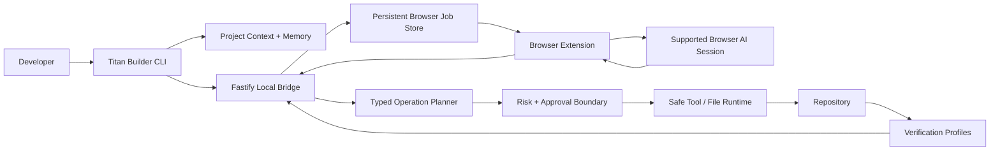

# Titan Builder

**Titan Builder is a security-focused local coding harness that turns browser AI output into reviewed, repository-bounded development operations.**

It combines a TypeScript CLI, Fastify local bridge, browser-extension workflow, persistent job state and verification profiles. The central engineering problem is authority: model output can propose work, but repository context, file operations, tools and mutation stay behind typed contracts, path checks, approval state and verification.

## Get started

### Requirements

- Node.js 22+
- pnpm 11.x
- Chromium for the browser-extension workflow

Install and run the repository-defined checks:

```bash
pnpm install --frozen-lockfile
pnpm build
pnpm verify
```

Useful focused lanes:

```bash
pnpm run typecheck
pnpm run test:skills
pnpm run check:skills
pnpm run check:extension
```

Development:

```bash
pnpm dev
```

The executable/package still contains the legacy `openbrowser` command and compatibility identifiers; the migration note in `package.json` remains part of the current interface.

### Fixture-based recruiter demo

The checked-in fixture lane on this branch gives a deterministic browser-first walkthrough of the local execution boundary:

```bash
pnpm install --frozen-lockfile
pnpm exec tsx scripts/recruiter-browser-first-demo.ts
```

It copies [docs/recruiter-fixtures/browser-first](docs/recruiter-fixtures/browser-first) into a temporary project and exercises real runtime contracts:

- captures filesystem project identity and rejects a path outside the project root;
- plans a reviewed `CREATE_FILE` operation without writing before approval;
- binds approval to project identity, run, conversation, selected operation and preview, then rejects stale-preview and token-replay attempts;
- consumes only the approved plan through Titan's safe dry-run executor, leaving the fixture unchanged;
- derives `pnpm run verify` from the fixture manifest and executes that read-only verification.

This is offline contract evidence: the deterministic lane does not open a browser, call a provider or use credentials. It does not claim live mutation or production readiness.

## Why it is interesting

- **Repository authority:** project resolution is centralized and privileged operations are constrained to canonical project roots, including traversal, symlink/junction and Windows-special-path defenses.
- **Approval-bound operations:** AI responses become Zod-validated structured operations with previews and risk summaries. Approval state is tied to project and repository identity so stale work is not silently replayed.
- **Recoverable browser jobs:** persisted jobs, leases, heartbeats and stale-response protection make extension/service-worker restarts observable instead of silently corrupting a run.
- **Verification-driven completion:** a response is not success by itself; selected verification profiles and required checks determine the final run state.
- **Executable skills:** skill manifests, validation, activation policy and dispatch make skills inspectable runtime components rather than prompt-only snippets.
- **Bounded context and memory:** project history, memory, prompts and context budgets are represented as local, bounded workflow state.

## Architecture

<p align="center">
  
</p>

The graphic is a source-backed map of the current local workflow; provider sessions and host integration remain environment-dependent.


```mermaid
flowchart LR
    D[Developer] --> CLI[Titan Builder CLI]
    CLI --> C[Project Context + Memory]
    CLI --> S[Fastify Local Bridge]
    S --> Q[Persistent Browser Job Store]
    Q --> E[Browser Extension]
    E --> M[Supported Browser AI Session]
    M --> E
    E --> S
    S --> O[Typed Operation Planner]
    O --> A[Risk + Approval Boundary]
    A --> T[Safe Tool / File Runtime]
    T --> R[Repository]
    R --> V[Verification Profiles]
    V --> S
```

The model/provider is treated as a proposal surface. The local bridge, operation planner, approval boundary and verification layer define what can be inspected, approved, executed and reported. Browser sessions and host integration remain environment-dependent.

## Example workflow

1. Resolve the active project and collect bounded context.
2. Queue work through the authenticated local bridge.
3. Route it to a supported browser AI session.
4. Parse the response into validated operations.
5. Generate a deterministic preview and risk summary.
6. Apply only approved operations inside the project boundary.
7. Run the selected verification profile.
8. Persist run evidence and final status.

## Code map

```text
src/                 CLI, server, projects, operations, memory and workflows
src/security/        Project-path, repository-identity and trusted-state boundaries
src/operations/      Typed planning, approval and safe execution
src/workflows/       Browser-run state, recovery and agent preparation/application
src/skills/          Skill manifests, loading, activation and dispatch
src/verification/    Verification-plan selection and execution contracts
browser-extension/   Browser integration and coding workspace
scripts/              Build, release and catalog tooling
docs/                 Architecture, security and operational documentation
.github/workflows/    Verification and security automation
.titan/               Historical implementation/audit work records
```

## Evidence and limitations

The package-defined verification entrypoint is `pnpm verify`; focused lanes include `pnpm typecheck`, `pnpm test:skills`, `pnpm check:skills` and `pnpm check:extension`. Use [docs/browser-first-smoke-checklist.md](docs/browser-first-smoke-checklist.md) for environment-specific provider, extension, service and two-stage UI validation.

The exact current-head verification is [Verify Titan Builder run #837](https://github.com/Masterleeaus/Titan-Builder/actions/runs/37181057724), which completed with failure before the root verification lane: workflow policy reports six inherited violations across three controller workflows, and Linux/Windows stop at frozen install because the existing lockfile contains a duplicate `braces@3.0.3` mapping. The required-CI aggregate therefore fails and the build/test jobs are skipped. The fixture remains bounded contract evidence; no passing full-verification or production-readiness claim is made.

The repository is an **advanced prototype in development**. Live provider sessions, browser-extension behavior and host-environment integration require environment-specific checks. The retained `OpenBrowser-v0.5.0-Project-Intelligence-Port.zip` and `.titan/` records are provenance or pending-work material, not supported runtime surfaces.

## Provenance and license

Titan Builder began from the MIT-licensed OpenBrowser project and retains the upstream copyright in [LICENSE](LICENSE). The repository now contains subsequent work in project authority, bridge security, operation safety, persistent workflow state, verification, skills and browser-workspace behavior. The upstream lineage is intentionally retained rather than obscured.

MIT. See [LICENSE](LICENSE) for the retained copyright and terms.

---

**Jason Lee**  
GitHub: [@Masterleeaus](https://github.com/Masterleeaus)
