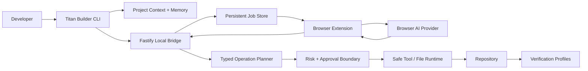

# Titan Builder

**A security-focused local coding harness that connects browser AI sessions to repository-aware development workflows.**

## Product architecture and engineering highlights

A local coding harness that connects browser AI sessions to repository-aware engineering workflows.

- **Architecture:** A TypeScript CLI and Fastify bridge coordinate project context, browser-extension jobs, structured file operations, skills, and verification behind repository-authority and path-safety controls.
- **Distinctive engineering:** Its differentiators are approval capabilities, bounded context, recoverable jobs, executable skills, and verification-driven completion rather than unrestricted model access.

## Overview

Titan Builder turns supported browser AI interfaces into a controlled coding environment for local projects. A TypeScript CLI and Fastify bridge coordinate prompts, project context, structured file operations, verification and browser-extension jobs while keeping repository mutation behind explicit security boundaries.

Rather than acting as an application UI generator, the current code is strongest as an **AI-assisted software engineering and workflow-execution system**. Its distinguishing work is the engineering around safe execution: project authority, bounded context, typed operations, approvals, process control, recovery, persistent runs and verification.

## Key Capabilities

- Ask and agent development workflows from a TypeScript CLI.
- Browser routing for multiple conversational AI providers.
- Repository-aware project context and active-project resolution.
- Zod-validated structured file/tool operations.
- Unified diff previews and approval before mutation.
- Safe tool registry for approved development commands.
- Persistent browser jobs with leases, heartbeats and restart recovery.
- Project memory, history and bounded context management.
- Reusable skills and agent profiles with activation policy.
- Verification profiles for build/test checks after changes.
- Security controls for paths, symlinks, VCS metadata and bridge authentication.
- Automated test, typecheck, build and CI verification pipeline.

## Architecture

<p align="center">
  
</p>


```mermaid
flowchart LR
    D[Developer] --> CLI[Titan Builder CLI]
    CLI --> C[Project Context + Memory]
    CLI --> S[Fastify Local Bridge]
    S --> Q[Persistent Job Store]
    Q --> E[Browser Extension]
    E --> M[Browser AI Provider]
    M --> E
    E --> S
    S --> O[Typed Operation Planner]
    O --> A[Risk + Approval Boundary]
    A --> T[Safe Tool / File Runtime]
    T --> R[Repository]
    R --> V[Verification Profiles]
```

## Example Workflow

1. Resolve the active project and collect bounded context.
2. Queue the job through the authenticated local bridge.
3. Route it to a supported browser AI session.
4. Parse the response into validated operations.
5. Generate a deterministic preview and risk summary.
6. Apply only approved operations inside the project boundary.
7. Run the selected verification profile.
8. Persist run evidence and final status.

> The current executable/package still contains the legacy `openbrowser` command and compatibility identifiers. They are documented as migration debt rather than presented as a separate product.

## Tech Stack

| Area | Technology |
|---|---|
| Language | TypeScript, JavaScript |
| Interface | CLI + Chrome extension side panel |
| Backend | Node.js, Fastify |
| Schemas | Zod |
| State | Local JSON/file-backed stores; extension local storage |
| AI | Browser-session routing across supported providers |
| Testing | Node test runner, Vitest, integration/E2E suites |
| Infrastructure | GitHub Actions, Dependabot, local service process |

## Engineering Highlights

### Repository authority and path safety
Project resolution is centralized and privileged operations are constrained to canonical project roots. The code includes protections against traversal, symlink/junction escapes, Windows special paths and model mutation of Git/VCS metadata.

### Approval capabilities instead of blind execution
AI responses are parsed into structured operations, previewed and bound to repository state before application. Approval state is tied to project/Git identity so stale approvals cannot simply be replayed after the working tree changes.

### Recoverable browser jobs
Browser work uses persisted job state, claim leases, heartbeats and stale-response protection so extension/service-worker restarts do not silently corrupt a run.

### Verification-driven completion
A run is not considered successful merely because an AI response arrived. Verification profiles can execute repository checks and failed required verification produces a failed run.

### Executable skill system
Skills have manifests, validation, activation semantics and a dispatcher boundary rather than existing only as prompt snippets.

## Getting Started

### Requirements

- Node.js 22+
- pnpm 11.x
- Chromium browser for the extension workflow

```bash
pnpm install --frozen-lockfile
pnpm build
pnpm verify
```

Development:

```bash
pnpm dev
```

Until the remaining executable identifiers are migrated, the built CLI is invoked with the compatibility command documented by `package.json`.

## Repository Structure

```text
src/                 CLI, server, operations, projects, memory and workflows
browser-extension/   Browser integration and coding workspace
src/skills/           Runtime skill manifests, loading, activation and dispatch
browser-extension/skill-library/  Packaged browser skill definitions
scripts/             Build, release and catalog tooling
docs/                Architecture, security and operational documentation
.github/workflows/    Verification and security automation
.titan/               Historical implementation/audit work records
```

## Status

**In Development / Advanced Prototype** — the core coding harness is substantial and heavily tested. The largest remaining presentation issue is migration of legacy OpenBrowser package, CLI and internal identifiers to Titan Builder.

## Verification and limits

The package-defined verification entrypoint is `pnpm verify`; the focused lanes are `pnpm typecheck`, `pnpm test:skills`, `pnpm check:skills`, and `pnpm check:extension`. The browser-first smoke checklist and security notes document what those checks do and do not cover.

This is an advanced prototype, not a production-readiness claim. Live provider sessions, browser-extension behavior, and host-environment integration still require the environment-specific checks described in [`docs/browser-first-smoke-checklist.md`](docs/browser-first-smoke-checklist.md). The retained `OpenBrowser-v0.5.0-Project-Intelligence-Port.zip` and `.titan/` records remain provenance/pending-work material and are intentionally not presented as a supported runtime surface.

## Provenance

Titan Builder began from the MIT-licensed OpenBrowser project and retains the upstream copyright in `LICENSE`. The repository now contains extensive subsequent work in project authority, bridge security, operation safety, persistent workflow state, verification, skills and browser-workspace behavior. The upstream lineage is intentionally retained rather than obscured.

## License

MIT. See [`LICENSE`](LICENSE) for the retained copyright and terms.

---

**Jason Lee**  
GitHub: [@Masterleeaus](https://github.com/Masterleeaus)
